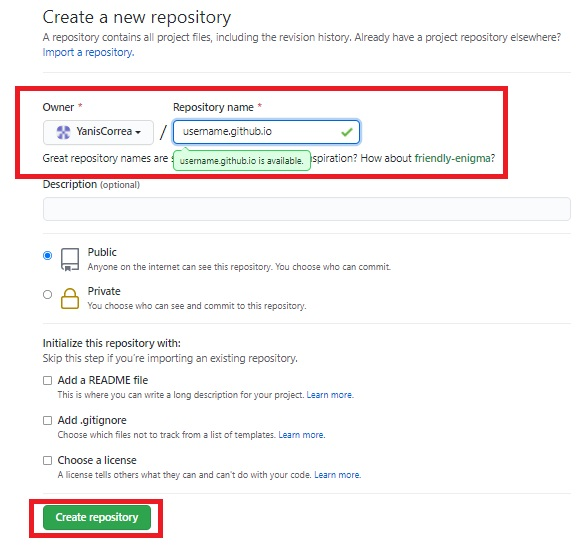
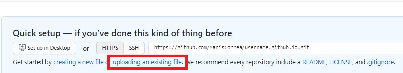
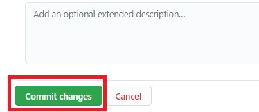

<a href="https://github.com/YanisCorrea?tab=repositories"><-- Back to my REPOSITORIES page</a>
# How To Create Your Own Web Page in Git Hub
## 1- Create your project's repository.
Login to your GitHub account and click the New repository icon from your account homepage.

## 2 - Name your repository
Name your repository username.github.io, replacing username with your GitHub username.

## 3 - Upload your Files
Select the option "uploading an existing file". Then choose the HTML file and the jpg File.
You need to create this files in your machine and save them in your computer. This is the information that other people will see in your web page.

## 4 - Drag and drop your created files.

## 5 - Commit your changes

## Access your Web Page in a Browser
Copy and paste your repostitory name into your Browser to access your Web Page.
Your repository name should be username.github.io, replacing username with your GitHub username.
As an example, I will access my own web page: https://yaniscorrea.github.io/

